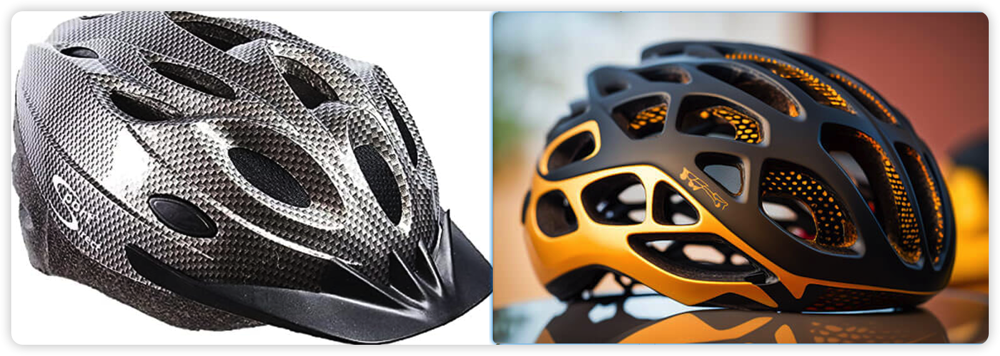
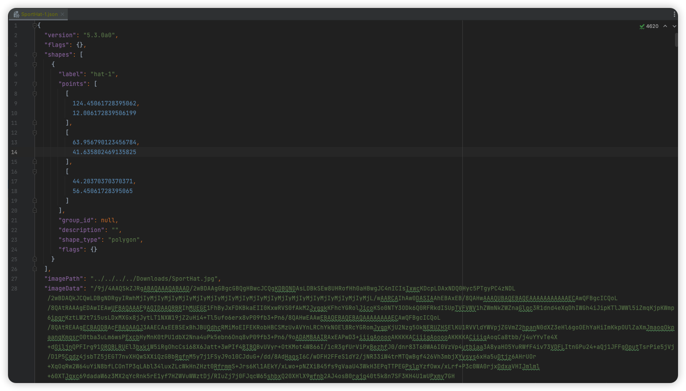

# YOLO5-Helmet
基于YOLO5目标检测算法实现安全帽脱帽、戴帽检测


## ✅调用摄像头
基于OpenCV调用笔记本电脑摄像头，将视频流转换为图像帧并保存JPG文件到磁盘。

<br>
以下是[OpenCV](https://www.geeksforgeeks.org/introduction-to-opencv/)使用较为重要的特性：
```markdown
1、Reading an image
2、Extracting the RGB values of a pixel
3、Extracting the Region of Interest (ROI)
4、Resizing the Image
5、Rotating the Image
6、Drawing a Rectangle
7、Displaying text
```

## 📌数据收集
首先，你需要收集带有安全帽和未戴安全帽的图片数据集。这些图片应涵盖不同场景、不同角度、不同光照条件等，以确保模型的`鲁棒性`。

## 📌数据标注 
对收集到的图片进行标注，将安全帽和未戴安全帽的位置和边界框标记出来，以便训练模型。<br>
数据标注工具`Labelme`：https://github.com/wkentaro/labelme/releases <br>
<br>
标注后的结果文件是`.json`格式，如下图：<br>
<br>

## 📌数据预处理
对标注的数据进行预处理，包括图像的缩放、归一化等，以便于模型的输入。

## 📌YOLOv5模型训练
使用标注好的数据集训练YOLOv5模型。你可以使用开源的YOLOv5代码库进行训练，也可以根据需要进行模型的微调。
### TODO
> 1、集成开源YOLO5模型
> <br>
> 2、远程部署Dockerfile-YOLO5
> <br>
> 3、服务器配置：RTX4090 GPU、AMD 5600G、32G运存、2TB SSD
> 


## 📌模型评估
训练完成后，使用测试数据集对模型进行评估，计算模型的精度、召回率等指标，确保模型在安全帽脱帽检测任务上的性能。

## 📌部署应用
将训练好的模型部署到实际应用中，可以是本地应用或者服务端应用，用于实时检测安全帽的佩戴情况。

## 📌系统集成
根据实际需求，将安全帽脱帽检测功能集成到现有的系统或者工作流程中，以实现实际的应用场景。

## 📌持续优化
对模型进行持续优化和更新，以适应实际应用中的不同场景和需求。
可能存在的问题：<br>
> 1、安全帽类型繁多，企业新研发出来的安全帽需要重新训练<br>
> 2、构建数据集成本高昂，人工标注数据点<br>
> 3、头盔颜色、头盔造型、图片清晰度、光照条件会对训练模型拟合度不好<br>